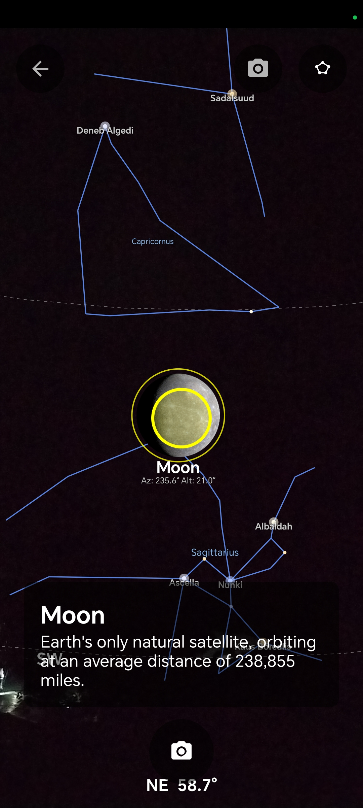
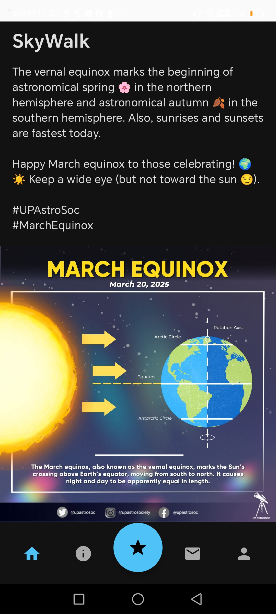

# SkyWalk 🌌

Point your phone at the sky and see stars and constellations overlaid on your camera view.


## What is this?

An Android app that uses device sensors to track where you're pointing your phone and overlays stars, constellations, and planets on the camera view. Includes social features and an astronomy encyclopedia.

## Screenshots

<p align="center">
  
  
  
  
</p>

## Features

- **Sky Overlay View**: Real-time star and constellation overlay using device sensors (accelerometer, magnetometer, rotation vector)
- **Encyclopedia**: Browse planets, stars, constellations with search and filtering
- **Social Feed**: Create posts with images, like and comment
- **Chat**: Send text and image messages
- **Authentication**: Email/password and Google Sign-In

## Tech Stack

- Kotlin + Jetpack Compose (with some XML layouts)
- CameraX for camera preview
- Device sensors for orientation tracking
- Firebase (Auth, Firestore, Storage)
- Room for local caching
- MVVM architecture
- Coroutines & Flow
- Retrofit, Coil

## Setup

### Prerequisites

- Android Studio Hedgehog (2023.1.1) or later
- JDK 17+
- Android device with gyroscope/magnetometer
- Firebase account

### Installation Steps

1. **Clone the repository**

   ```bash
   git clone https://github.com/yourusername/skywalk.git
   cd skywalk
   ```

2. **Create Firebase Project**

   - Go to [Firebase Console](https://console.firebase.google.com/)
   - Click "Add project" and follow the setup
   - Add an Android app with package name: `com.example.skywalk`

3. **Download Firebase Config**

   - In Firebase Console → Project Settings → Your apps
   - Download `google-services.json`
   - Place it in `app/` directory (same level as `build.gradle.kts`)

4. **Enable Firebase Services**

   - **Authentication**:
     - Firebase Console → Authentication → Get Started
     - Sign-in method tab → Enable "Email/Password"
     - Sign-in method tab → Enable "Google" → Enable → Save
   - **Firestore Database**:
     - Firebase Console → Firestore Database → Create Database
     - Start in test mode (for development)
     - Choose a location
   - **Storage**:
     - Firebase Console → Storage → Get Started
     - Start in test mode
     - Done

5. **Configure Google Sign-In**

   - Get your debug keystore SHA-1:

     ```bash
     # On macOS/Linux
     keytool -list -v -keystore ~/.android/debug.keystore -alias androiddebugkey -storepass android -keypass android

     # On Windows
     keytool -list -v -keystore %USERPROFILE%\.android\debug.keystore -alias androiddebugkey -storepass android -keypass android
     ```

   - Copy the SHA-1 fingerprint
   - Firebase Console → Project Settings → Your apps → Add fingerprint
   - Paste SHA-1 and save
   - Download the updated `google-services.json` and replace the old one

6. **Build and Run**
   - Open project in Android Studio
   - Sync Gradle files
   - Connect device via USB
   - Click Run (or Shift + F10)

### Firestore Setup (Optional)

The app will work without pre-populated data, but you can add sample celestial objects:

- Firebase Console → Firestore Database → Start collection:
  - Collection: `celestial_objects`
  - Document ID: auto-generated
  - Fields:
    ```json
    {
      "name": "Mars",
      "type": "PLANET",
      "description": "The Red Planet",
      "summary": "Fourth planet from the Sun",
      "imageUrl": "",
      "keywords": ["planet", "mars", "red planet"]
    }
    ```

## Architecture

```
app/
├── core/              # Shared utilities, navigation
├── features/
│   ├── ar/            # Sensor tracking, astronomy calculations, overlay view
│   ├── auth/          # Login, registration, profile
│   ├── chat/          # Messaging system
│   ├── encyclopedia/  # Celestial object database
│   ├── home/          # Home screen
│   └── socialmedia/   # Posts, comments, likes
```

Each feature follows: `data/` → `domain/` → `presentation/`

## How It Works

### Sensor Tracking

- Reads rotation vector, accelerometer, and magnetometer sensors
- Applies low-pass filtering to smooth out jittery movements
- Calculates device orientation (azimuth, pitch, roll)

### Coordinate Conversion

- Converts celestial coordinates (Right Ascension/Declination) to horizontal coordinates (Altitude/Azimuth)
- Uses user's location and current time for accurate positioning
- Projects sky coordinates onto screen space

### Overlay Rendering

- Custom `SkyOverlayView` draws directly on Canvas
- Renders stars as circles sized by magnitude
- Draws constellation lines between connected stars
- Shows compass directions and altitude guides

## Technical Highlights

- **Sensor Fusion**: Combines multiple sensors with low-pass filtering for stable tracking
- **Astronomy Math**: Coordinate transformations between equatorial and horizontal systems using spherical trigonometry
- **Dynamic Star Loading**: Loads stars from JSON asset files, filters by magnitude
- **Constellation Data**: GeoJSON-based constellation boundaries and star connections

## Contributing

This is a learning project, but PRs and suggestions are welcome!

## License

MIT
